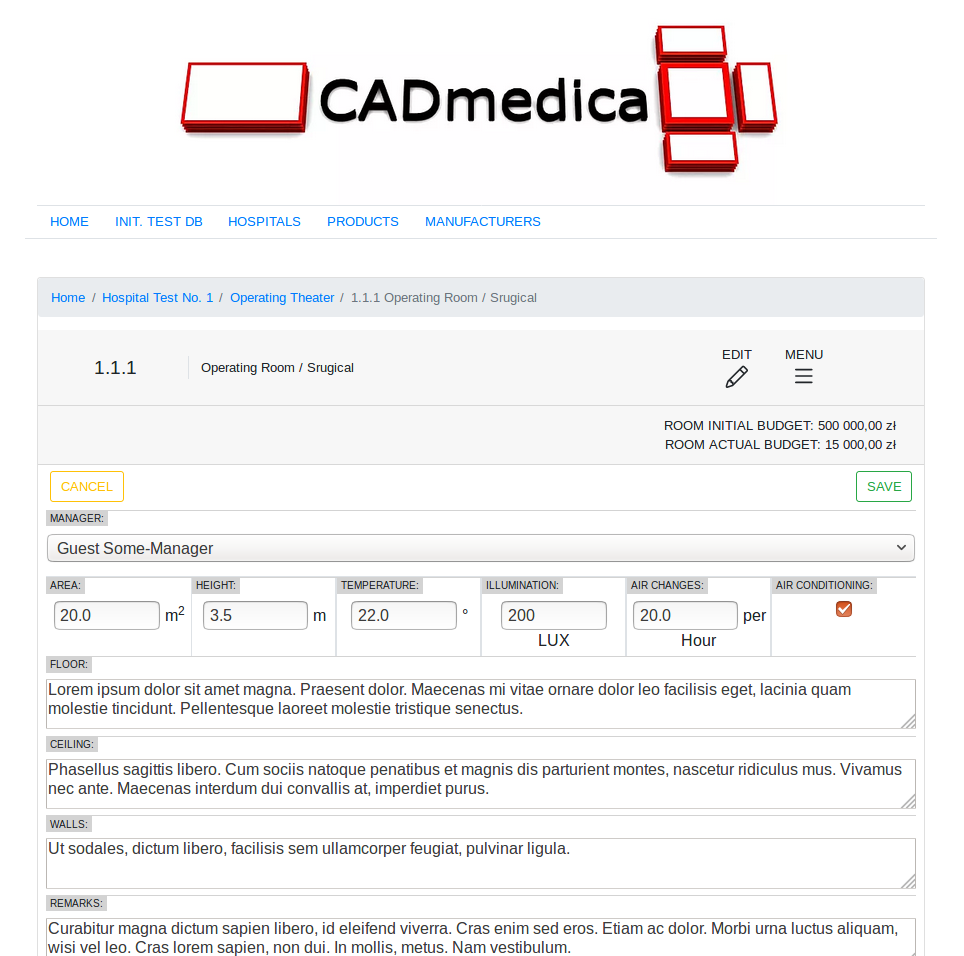
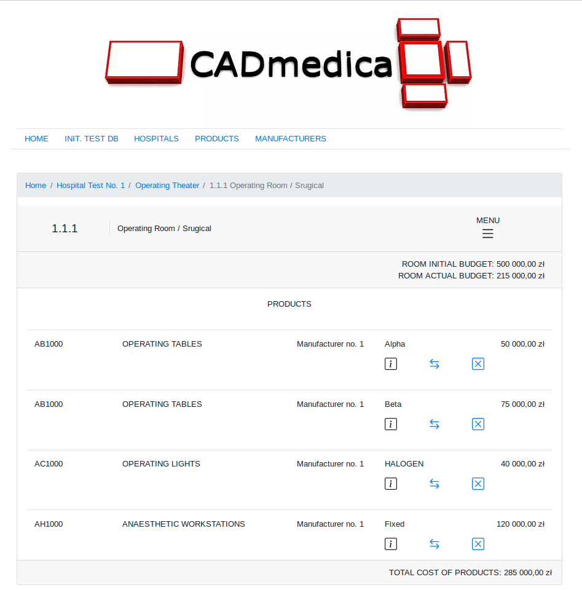

# CADMDB (in progress..)

## IDEA
The main idea of the application is to help going through the planning process of hospitals departments' and rooms' structure as well as calculating costs of medical devices.
The core of the application is to standardize names of typical departments', rooms' and devices' categories, so that all people involved in planning process would use the same names and have possibility to measure and compare the costs, power consumption and other parameters needed to build new well-calculated hospital.

## PAGES AND FUNCTIONALITY

### ALL HOSPITALS PAGE:

The list with all hospitals existing in database. 
Functionality depends on which user category is logged in:
* **Administrator** can see organizational structure of each hospital and information about budget connected with its departments and rooms. This page allows administrator to add new hospital, to see details and to delete every department, room or product.
* **Investor** (in progress...)
* **Hospital's manager/employee** (in progress...)
* **Hospital's designer** (in progress...)
* **Hospital's building contractor** (in progress...)
* **Manufacturer** of medical devices (access denied)

### ROOM DETAILS PAGE

The page is divided for 3 sub-pages:
- general info - main information about the room,
- products added - the list of medical devices planned to be delivered,
- financial analysis - 3 progress bars showing percentage of the room/department/hospital budget.

<!-- (

)-->

### ALL PRODUCTS PAGE:

The list of all products sorted by product category and possible to add to hospital rooms. 
Functionality depends on which user category is logged in:
* **Administrator** (in progress...)
* **Investor** (in progress...)
* **Hospital's manager/employee** (in progress...)
* **Hospital's designer** (in progress...)
* **Hospital's building contractor** (in progress...)
* **Manufacturer** of medical devices (access denied)

### ALL MANUFACTURERS PAGE:

The list of all manufacturers with its products, sorted by product category. 
Functionality depends on which user category is logged in:
* **Administrator** (in progress...)
* **Investor** (in progress...)
* **Hospital's manager/employee** (in progress...)
* **Hospital's designer** (in progress...)
* **Hospital's building contractor** (in progress...)
* **Manufacturer** (in progress...)

## USED TECHNOLOGIES
* Java
    * Spring MVC
    * Hibernate
    * MySQL
* HTML/CSS/BootStrap
* Intellij